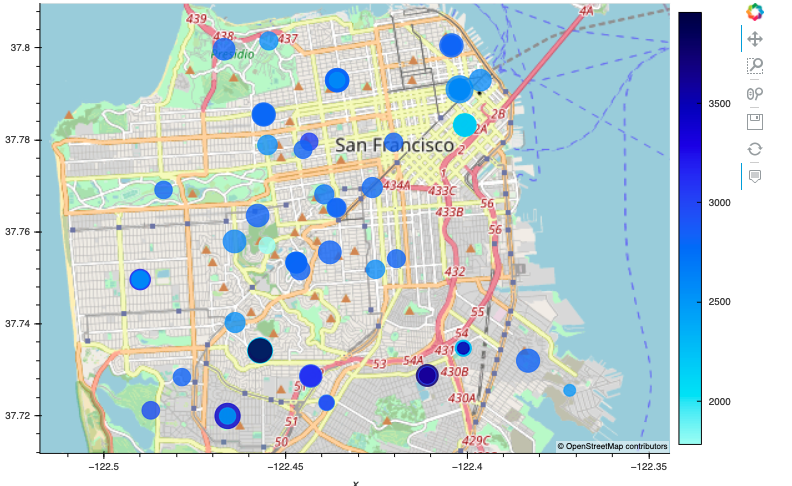

# Module_6_challenge

Hello, this project is about the Financial planning tools for housing units. This tool is designed to help individuals manage their finances, create a financial plan, and achieve their financial goals. These tools may include spreadsheets, budgeting apps, and investment calculators. Using Pandas as main package to run and test sequences.

---

## Technologies

pandas is a software library written for the Python programming language for data manipulation and analysis. In particular, GeoViews is a Python library for creating interactive visualizations of geospatial data. GeoViews provides a high-level interface for creating a wide range of visualizations, including maps, scatter plots, heatmaps, and more. It is designed to work with a variety of geospatial data formats, including shapefiles, GeoJSON, and raster data. With GeoViews, users can easily create interactive visualizations that allow them to explore and analyze their geospatial data in new and powerful ways.
---

## Installation Guide

Import the correct packages to begin coding.

---

## Usage

Use Plots and data frame to get the correct portfolio

---

## Contributors

-Name: John Nguyen
-Email: nguyenjohn1337@gmail.com

---

## License

When you share a project on a repository, especially a public one, it's important to choose the right license to specify what others can and can't with your source code and files. Use this section to include the license you want to use.

Specify the details of your project’s license - that is, how others can or cannot use your code and files.
